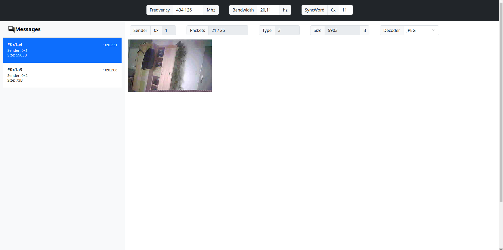

# Simple Lora arduino ground station [WIP]

Simple SSDO lora ground station SW. Connets to your WIFI and crete simple UI for manage.

Supported SSDO types:

* Image
* Text
* UKHAS
* Change

# Target board

TTGO-Lora32-v1

if you want use another board you must rewrite PIN mapping and LORA radio type.

# Before upload to board

Chage WIFI SSID and Password in src/main.cpp file

# Upload

Use platformio and click on "Upload and monitor"

After upload is done you can see terminal with IP of iterface -> enter IP to browser.

